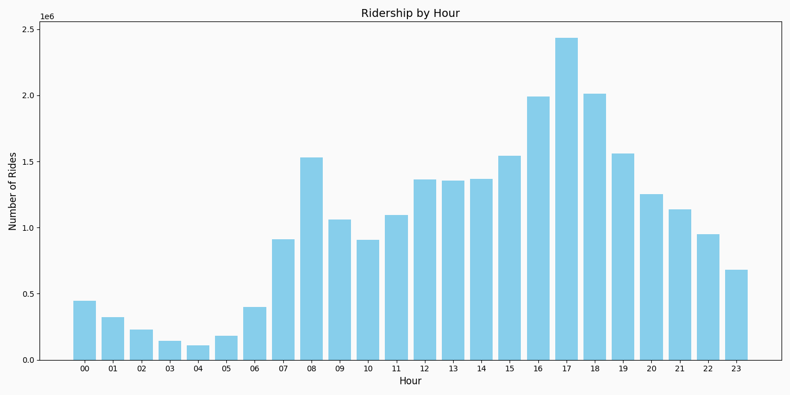
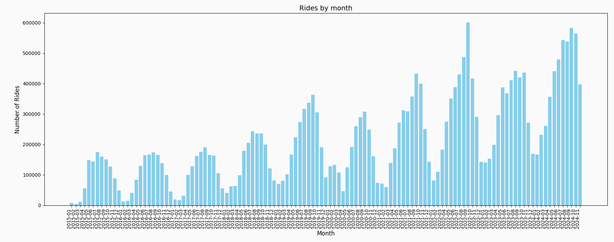
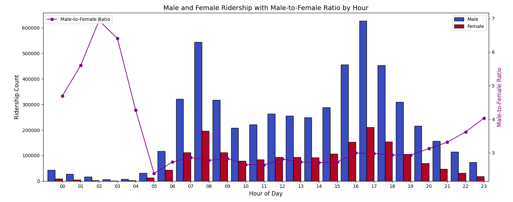
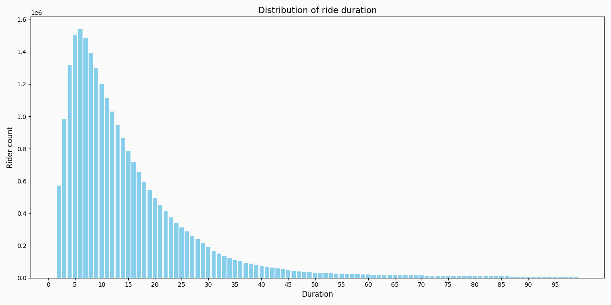

# Data analysis of Boston's BlueBikes

Date Range: 2015 - 2024 (Nov)

Total number of rides: 24,982,591

## Ridership by hour of day

The graph is more or less what we might expect to see. Large peaks around commuting hours and slow decline the later into the night it gets.

## Ridership by the month of the year

Again, the graph is what we might expect. Ridership drops more than half in the colder months of the year, and we see a small hit in ridership during the early months of the pandemic. Outside of the pandemic, ridership has increased every year since BlueBikes has been around.

## Analysis on gender metrics.

Gender was an optional item that users could report so we must recognize that there can be some data in this self-reported data (or for instance, that one gender is more likely to report their gender than another).

Of the 25 million entries:

| Reported gender | Count |
|-----------------|-------|
| Male | 5,321,440 |
| Female | 1,830,302 |
| Did not report | 1,227,346 |
| Field was null | 16,603,503 |

With this in mind, we can look to see what meaningful distance exists in ridership.

This displays not only the raw numbers by gender for each hour, but also shows the ratio of male / female ridership at each hour. We can see that men out number women 7:1 at the hours of 02:00 and this is the peak of the ratio. The point where ridership is most evenly matched between men and women is 05:00, where men are 2.5:1 women.

## Station popularity:

The most popular stations to start from:

| Rank | Station Name | Raw Count |
|------|--------------|-----------|
| 1  | MIT at Mass Ave / Amherst St                                           | 571,519 |
| 2  | Central Square at Mass Ave / Essex St                                  | 442,261 |
| 3  | Harvard Square at Mass Ave/ Dunster                                    | 366,021 |
| 4  | MIT Stata Center at Vassar St / Main St                                | 294,228 |
| 5  | MIT Pacific St at Purrington St                                        | 291,879 |
| 6  | Ames St at Main St                                                     | 287,168 |
| 7  | MIT Vassar St                                                          | 266,956 |
| 8  | Charles Circle - Charles St at Cambridge St                            | 259,112 |
| 9  | Christian Science Plaza - Massachusetts Ave at Westland Ave            | 234,464 |
| 10 | South Station - 700 Atlantic Ave                                       | 230,370 |
| 11 | Beacon St at Massachusetts Ave                                         | 221,533 |
| 12 | Kendall T                                                              | 221,317 |
| 13 | Central Sq Post Office / Cambridge City Hall at Mass Ave / Pleasant St | 212,163 |
| 14 | One Kendall Square at Hampshire St / Portland St                       | 202,158 |
| 15 | Nashua Street at Red Auerbach Way                                      | 194,896 |
| 16 | Boylston St at Massachusetts Ave                                       | 185,684 |
| 17 | Harvard University River Houses at DeWolfe St / Cowperthwaite St       | 177,020 |
| 18 | Commonwealth Ave at Agganis Way                                        | 175,591 |
| 19 | Cross St at Hanover St                                                 | 174,152 |
| 20 | Newbury St at Hereford St                                              | 172,022 |

Most popular stations to end at: 
| Rank | Station Name | Raw Count |
|------|--------------|-----------|
| 1  | MIT at Mass Ave / Amherst St                                           | 560,436 |
| 2  | Central Square at Mass Ave / Essex St                                  | 442,904 |
| 3  | Harvard Square at Mass Ave/ Dunster                                    | 377,995 |
| 4  | Ames St at Main St                                                     | 320,121 |
| 5  | MIT Stata Center at Vassar St / Main St                                | 309,804 |
| 6  | MIT Pacific St at Purrington St                                        | 277,257 |
| 7  | Charles Circle - Charles St at Cambridge St                            | 259,541 |
| 8  | MIT Vassar St                                                          | 250,426 |
| 9  | Christian Science Plaza - Massachusetts Ave at Westland Ave            | 236,455 |
| 10 | Nashua Street at Red Auerbach Way                                      | 228,199 |
| 11 | South Station - 700 Atlantic Ave                                       | 225,922 |
| 12 | Beacon St at Massachusetts Ave                                         | 216,052 |
| 13 | Kendall T                                                              | 212,122 |
| 14 | Central Sq Post Office / Cambridge City Hall at Mass Ave / Pleasant St | 208,904 |
| 15 | One Kendall Square at Hampshire St / Portland St                       | 194,927 |
| 16 | Boylston St at Massachusetts Ave                                       | 187,754 |
| 17 | Commonwealth Ave at Agganis Way                                        | 177,173 |
| 18 | Harvard University River Houses at DeWolfe St / Cowperthwaite St       | 175,976 |
| 19 | Cross St at Hanover St                                                 | 175,423 |
| 20 | Copley Square - Dartmouth St at Boylston St                            | 174,502 |

Most popular routes:
| Rank | Start | End | Raw Count |
|------|-------|-----|-----------|
| 1  | MIT at Mass Ave / Amherst St | Beacon St at Massachusetts Ave | 34883 |
| 2  | MIT at Mass Ave / Amherst St | MIT Vassar St | 34335 |
| 3  | Beacon St at Massachusetts Ave | MIT at Mass Ave / Amherst St | 33650 |
| 4  | MIT Vassar St | MIT Stata Center at Vassar St / Main St | 32078 |
| 5  | MIT at Mass Ave / Amherst St | Central Square at Mass Ave / Essex St | 31402 |
| 6  | MIT Pacific St at Purrington St | MIT Stata Center at Vassar St / Main St | 31013 |
| 7  | MIT Vassar St | MIT at Mass Ave / Amherst St | 29938 |
| 8  | MIT Stata Center at Vassar St / Main St | MIT Pacific St at Purrington St | 28149 |
| 9  | Central Square at Mass Ave / Essex St | MIT Pacific St at Purrington St | 27777 |
| 10 | MIT Vassar St | Ames St at Main St | 25234 |
| 11 | MIT Stata Center at Vassar St / Main St | MIT Vassar St | 25177 |
| 12 | Linear Park - Mass. Ave. at Cameron Ave.  | Davis Square | 24464 |
| 13 | MIT Pacific St at Purrington St | Ames St at Main St | 24317 |
| 14 | Central Square at Mass Ave / Essex St | MIT at Mass Ave / Amherst St | 24103 |
| 15 | MIT Pacific St at Purrington St | Central Square at Mass Ave / Essex St | 23406 |
| 16 | Davis Square | Linear Park - Mass. Ave. at Cameron Ave.  | 23016 |
| 17 | MIT Pacific St at Purrington St | MIT at Mass Ave / Amherst St | 22970 |
| 18 | Harvard Square at Mass Ave/ Dunster | Harvard University Radcliffe Quadrangle at Shepard St / Garden St | 21650 |
| 19 | MIT at Mass Ave / Amherst St | MIT Pacific St at Purrington St | 18539 |
| 20 | MIT at Mass Ave / Amherst St | MIT at Mass Ave / Amherst St | 18152 |

## Trip Duration

The data provivdes the exact amount of seconds the trip lasts, but for this we bucket it into minutes for easy viewing. The graph follows an exponential random distribution.
